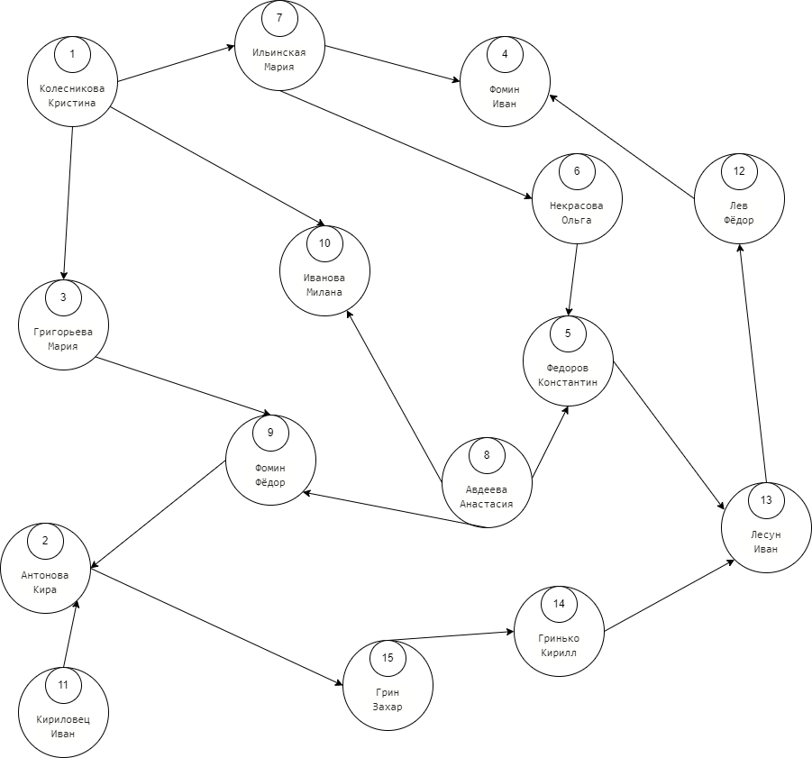
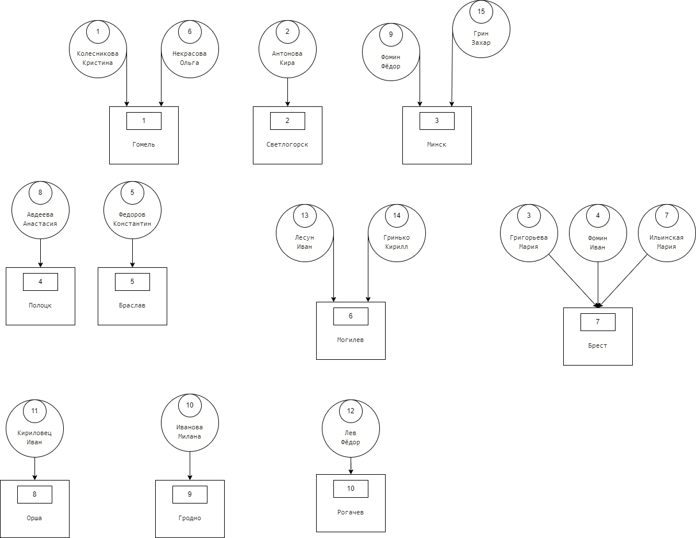
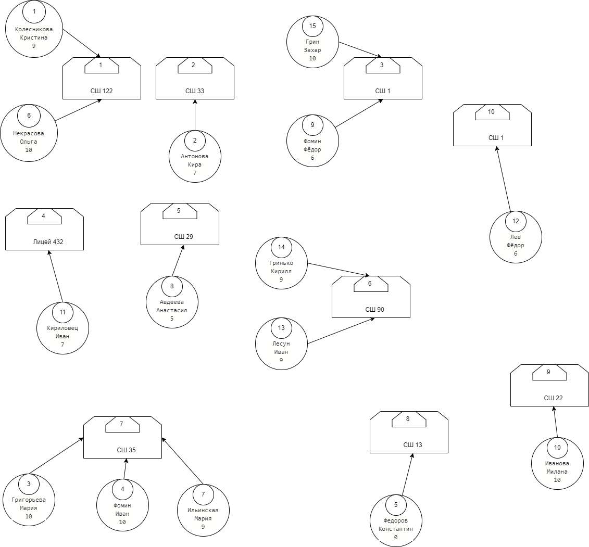

# база данных "одногруппники"

## граф кто у кого списывает:


## граф кто из какого города приехал:


## граф кто из какой школы и как он ее оценил

```
!!! таблица School имеет два поля name, hometown. hometown - это область в которой находся школа, не связывайте ее с городом откуда приехал студент(она связана с областью откуда приехал студент)
```


